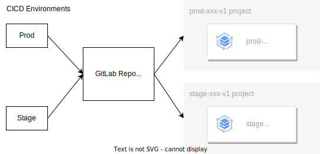

# Infrastructure as Code with GitLab and Terraform (GKE)

## CICD Overview

We are trying to use trunk-based development and GitOps methodology, where we use only one default (`main`) branch. Any changes applied to staging first and later to production.

<p align="center">
  
</p>


## Getting Started

1. Create organization from GCP console.
2. Create projects (e.g., production, staging) under the organization
```shell
gcloud projects create prod-v3 --organization=<organization number>
gcloud projects create stage-v3 --organization=<organization number>
```
3. Copy newly created projects IDs example and store in `.envrc` file
```shell
# GCP
export PROJECT_ID=prod-v3
export SERVICE_ACCOUNT_NAME=${PROJECT_ID}
export SERVICE_ACCOUNT_EMAIL="${SERVICE_ACCOUNT_NAME}@${PROJECT_ID}.iam.gserviceaccount.com"
```
4. Link the project(s) with Billing account from GCP [Billing](https://console.cloud.google.com/) (left sidebar).
5. Run the following script to create a service account and download its key (e.g., `stage-v3`)
```shell
bash bin/service-account.sh
```
6. Take base64 by running the following command and add it into GitLab CICD's as `BASE64_GOOGLE_CREDENTIALS` variables, as stated [here](https://docs.gitlab.com/ee/user/infrastructure/clusters/connect/new_gke_cluster.html#create-your-gcp-credentials)
```shell
base64 -i prod-v3 | tr -d \\n | pbcopy
```
8. Enable K8s Engine API by running the following command:
```shell
gcloud services enable container.googleapis.com --project=${PROJECT_ID}
```
9. Update respective `.tfvars` files in `/var` dir

## Reference

This repository contains sample code for creating a Google Kubernetes Engine (GKE) cluster using [GitLab Infrastructure as Code](https://docs.gitlab.com/ee/user/infrastructure/), and connecting it to GitLab with the [GitLab agent for Kubernetes](https://docs.gitlab.com/ee/user/clusters/agent/).

For more information on how to use it, please refer to the [official docs](https://docs.gitlab.com/ee/user/infrastructure/clusters/connect/new_gke_cluster.html).
